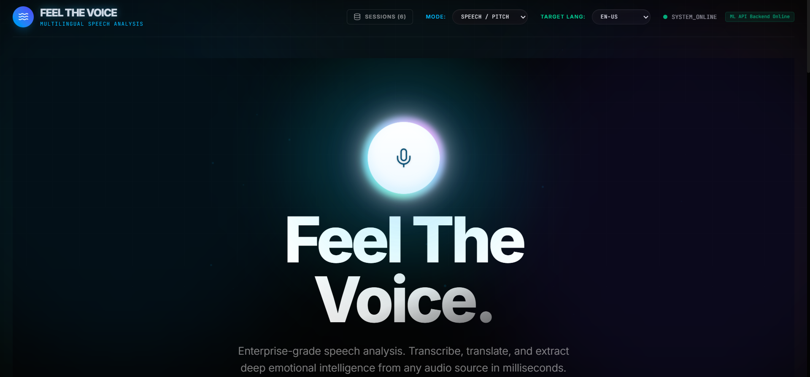

# Feel The Voice 

<div align="center">
  
  


  [](https://vitejs.dev/)
  [](https://reactjs.org/)
  [](https://expressjs.com/)
  [](https://feelthevoice.ai)
</div>

---

## Overview

**Feel The Voice** is a state-of-the-art proprietary speech analysis engine designed to bridge the gap between raw audio and actionable semantic insights. Built with a high-performance "animateic" interface, it leverages high-density neural models to provide real-time translation, emotion tracking, and RAG-enabled chat intelligence.

Whether you're analyzing corporate meetings, academic lectures, or public speeches, Feel The Voice provides a comprehensive dossier of every acoustic detail.

## Core Features

- Global Translation Suite: Support for 100+ languages and dialects with automatic source detection.
- Emotion Radar: Temporal tracking of prosody and vocal sentiment to map the speaker's emotional state throughout the recording.
- Speaker Diarization: Accurately identifies "who spoke when," enabling clear multi-speaker transcriptions.
- Neural Low Latency: Optimized pipeline for sub-2 second analysis times, even for complex audio files.
- RAG-Powered Chat: Interact with your audio data using a Retrieval-Augmented Generation (RAG) system to ask deep questions about the content.
- Privacy Preserved: Edge-grade security and local session persistence using IndexedDB.

## Tech Stack

- **Frontend:** React 18, Vite, Framer Motion (for "animateic" UX), Lucide Icons, Recharts.
- **Backend:** Node.js (Express), `tsx` for TypeScript execution.
- **AI/ML:** Proprietary Neural Inference Layer (via External API).
- **Storage:** Local IndexedDB (for sessions) and In-memory Vector Store (for RAG).

## Installation and Setup

### Prerequisites
- [Node.js](https://nodejs.org/) (v18 or higher)
- A **Neural Engine API Key**

### Steps

1. **Clone the Repository:**
   ```bash
   git clone https://github.com/muskan-1301/Feel-The-Voice.git
   cd Feel-The-Voice
   ```

2. **Install Dependencies:**
   ```bash
   npm install
   ```

3. **Environment Configuration:**
   Create a `.env` file in the root directory and add your API key:
   ```env
   NEURAL_API_KEY=your_api_key_here
   APP_URL=http://localhost:3000
   ```

4. **Launch the Application:**
   ```bash
   npm run dev
   ```

The application will be available at [http://localhost:3000](http://localhost:3000).

## Architecture

Feel The Voice uses a modular orchestration pattern:
1. **Preprocessing:** Audio is normalized and segmented.
2. **ASR & Translation:** Handled via custom inference layers for maximum context retention.
3. **Sentiment Analysis:** Parallelized prosody mapping and keyword extraction.
4. **Vectorization:** Transcript segments are embedded and stored for instant RAG retrieval.

## 📄 License

Distributed under the MIT License. See `LICENSE` for more information.

---

<div align="center">
  Developed by the Feel The Voice Team
</div>
